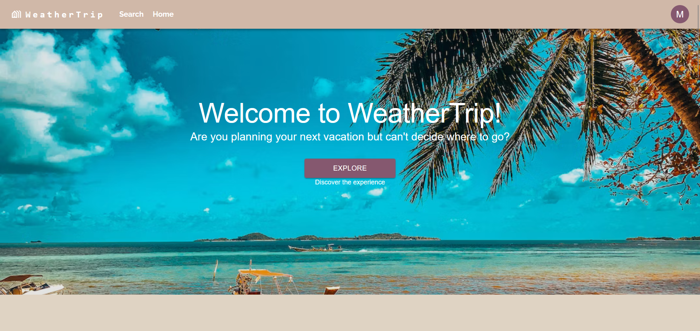
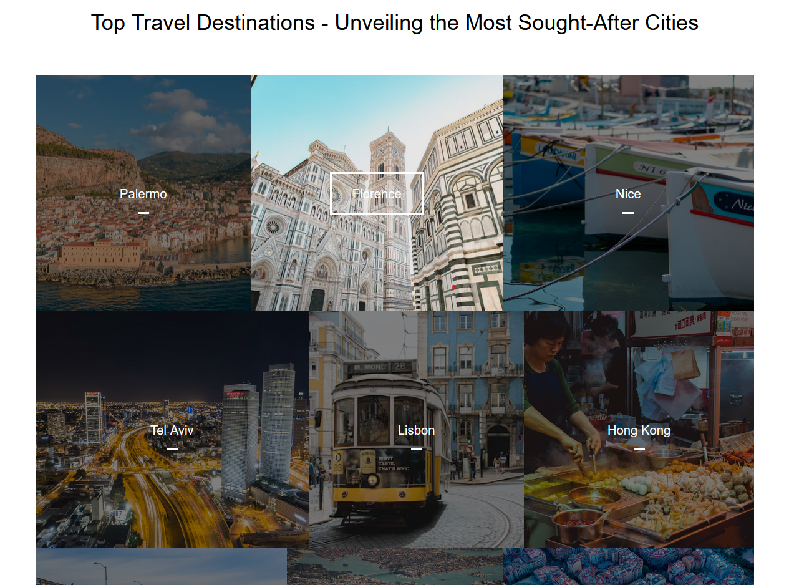
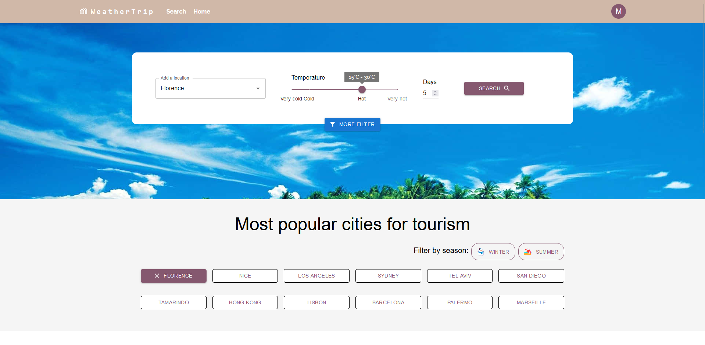
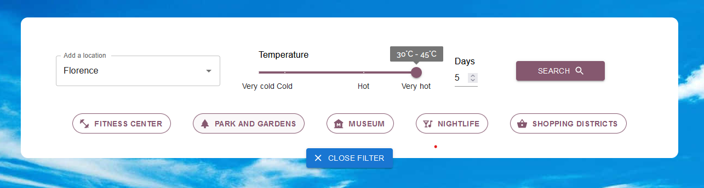
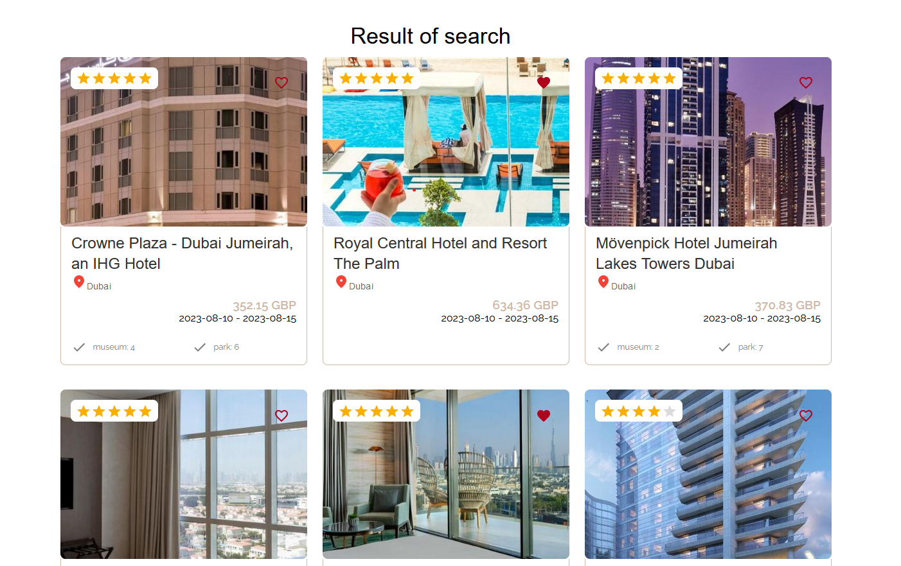
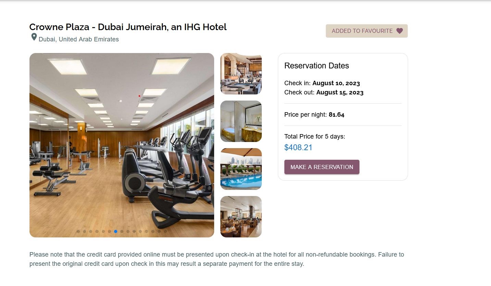
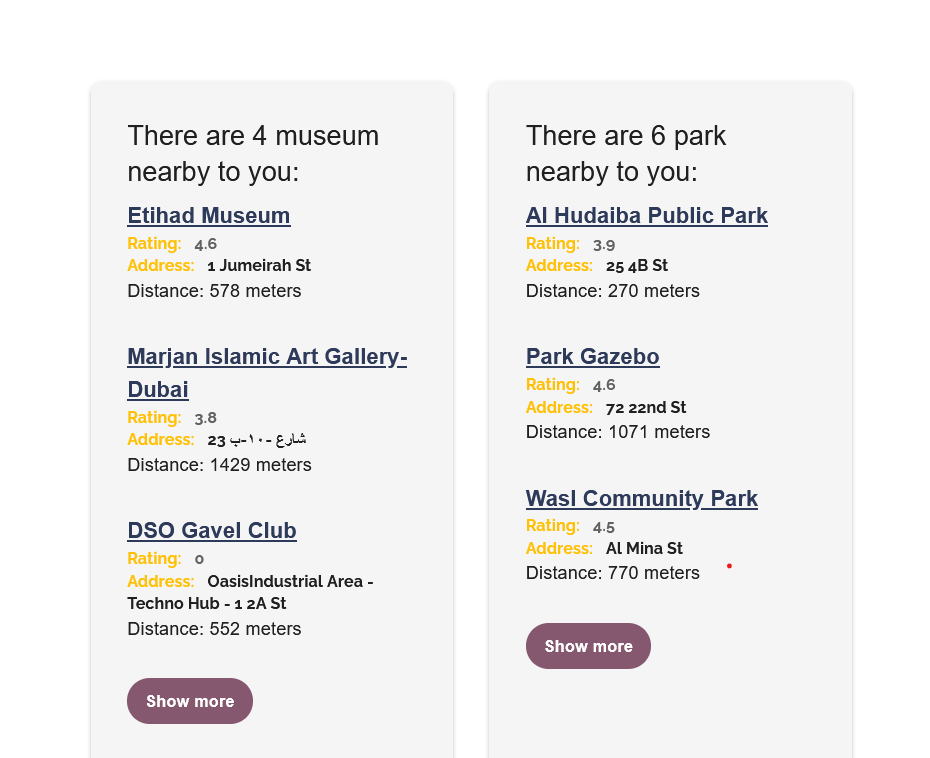
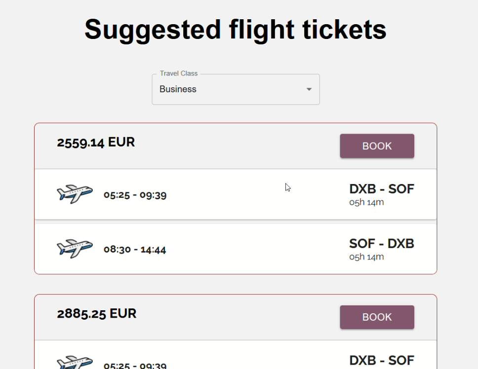

# Weather Trip

Welcome to WeatherTrip, your ultimate vacation planning platform that combines weather information,
hotel options, and flight tickets to help you find your dream vacation.

## Introduction

WeatherTrip is a comprehensive and convenient solution for travelers seeking the perfect vacation.
By integrating weather forecasts, hotel options, and flight tickets in one platform, we aim to simplify the travel planning process
and make it an enjoyable experience.

## Features

- **Weather Forecast**: Find cities with your desired weather conditions using our temperature API interface.

- **Google Maps**: Explores nearby points of interest to enhance your travel experience.

- **Hotel Catalog**: Explore an extensive collection of hotels in various cities. Apply filters to discover the ideal hotel that meets your requirements.

- **Flight Tickets**: Let us take care of your transportation needs by utilizing the flight ticket API.

- **Easy Booking**: Once you've found the right hotel or flight, book and pay seamlessly using your bank card with the Stripe API integration.

## Future Enhancements

I am dedicated to continuously improving WeatherTrip. Future enhancements include:

- Additional Filters: Enhance your search by adding filters for adults, children, rooms, price, rating, and star categories.
- Interactive Maps: Visualize destinations and hotel locations on an interactive map.
- Reviews and Recommendations: Incorporate user reviews and recommendations for hotels and destinations.

## Technologies Used

- **Spring Boot**: Backend framework for building robust and scalable applications.
- **React**: Frontend library for building dynamic and interactive user interfaces.
- **Material-UI (MUI)**: React UI framework for creating modern designs.
- **MySQL**: Relational database management system for storing structured data.
- **Redis**: In-memory data store for caching and improving application performance.

### Home Page

At WeatherTrip, we understand that the perfect vacation starts with the perfect destination.

The section where you can directly select your city.

### Search Page

- Begin by selecting your favorite city from our extensive list of options.
- Next, indicate your desired temperature range. Whether you're longing for a tropical paradise or a cozy winter escape,
  our platform will filter hotels that match your climate preferences.
- But that's not all - you can filter your hotel options based on the season you wish to travel in.

- The addition of the "More Filters button" feature introduces a new level of customization, allowing users to
  align their hotel selection with their interests and activities.

### Hotel Detailed Page

- Delve into a wealth of information about your selected hotel.
  
  
- Furthermore, users don't have to worry about transportation as the application can
  take care of that by suggesting the flight tickets.
  